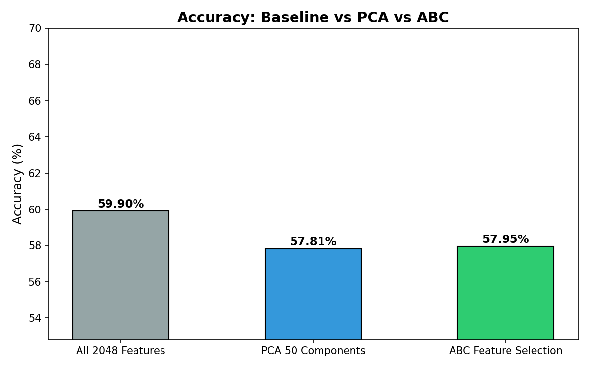
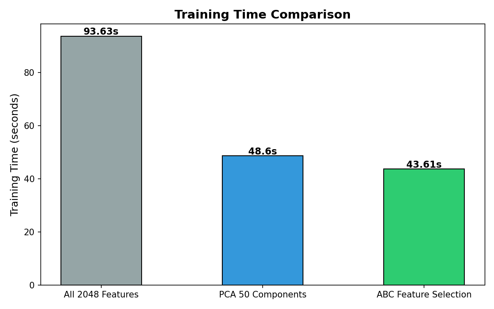
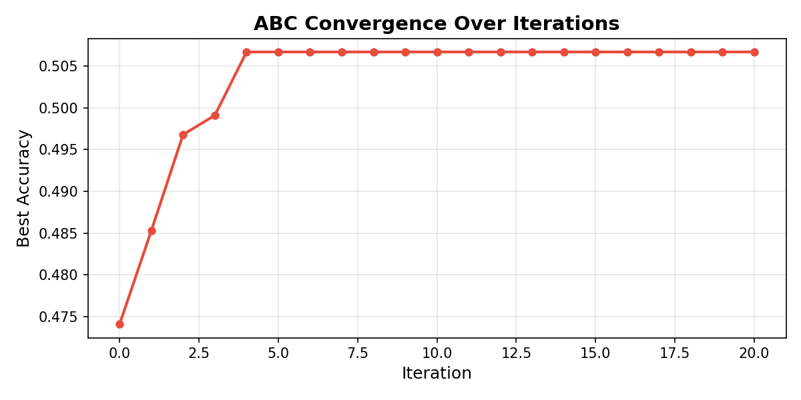
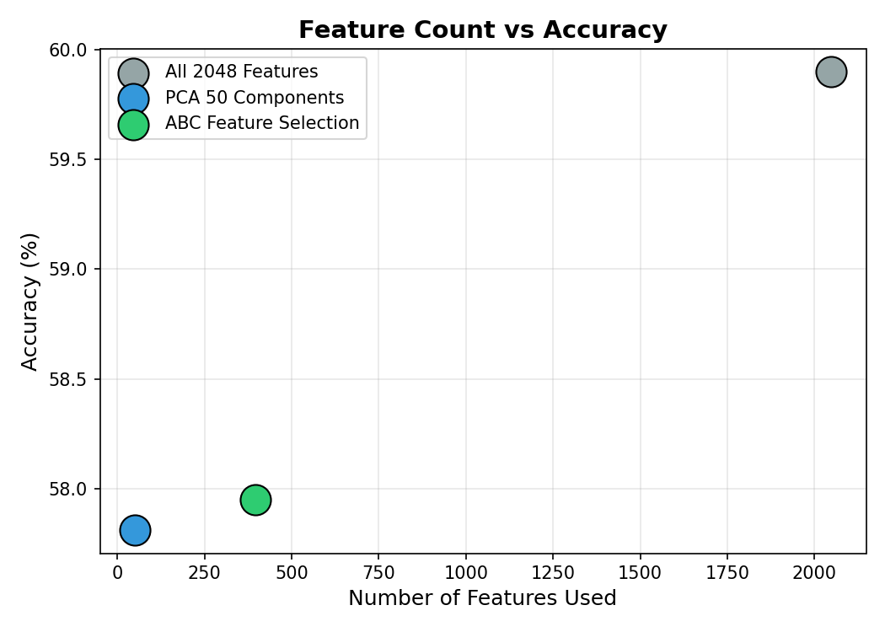

# CIFAR-10 Classification using ResNet50 + ABC Feature Selection

## Overview
This project implements the **Artificial Bee Colony (ABC)** metaheuristic 
optimization algorithm for intelligent feature selection on deep learning 
features extracted from ResNet50, applied to the CIFAR-10 image 
classification benchmark.

## Problem Statement
ResNet50 extracts 2048 features per image. Not all features are useful.
Training on all 2048 features wastes time and memory. ABC intelligently 
finds the best subset — reducing features while maintaining accuracy.

## Results

| Method | Accuracy | Features Used | Training Time |
|---|---|---|---|
| All ResNet Features (Baseline) | 59.90% | 2048 | 93.6s |
| PCA (50 components) | 57.81% | 50 | 48.6s |
| **ABC Feature Selection** | **57.95%** | **397** | **43.6s** |

### Key Findings
- ABC reduced features by **80%** (2048 → 397)
- ABC training is **2x faster** than baseline (43.6s vs 93.6s)
- ABC accuracy is **better than PCA** (57.95% vs 57.81%)
- Only **2% accuracy loss** compared to using all features

## Plots
### Accuracy Comparison


### Training Time Comparison


### ABC Convergence Curve


### Features vs Accuracy


## How ABC Works
```
3 types of bees:
- Employed Bees  → explore current feature subsets
- Onlooker Bees  → improve the best subsets found
- Scout Bees     → abandon bad subsets, explore randomly

Each "food source" = binary array [1,0,1,1,0,...] 
selecting which features to keep.
Fitness = Random Forest accuracy on selected features.
```

## Tech Stack
- Python 3
- TensorFlow / Keras
- Scikit-learn
- NumPy
- Matplotlib

## How to Run
1. Open in Google Colab
2. Run cells in order 1 → 14
3. Results saved automatically

## Author
Chintakunta Kuruba Sivarama Krishna — [https://www.linkedin.com/in/siva-kuruba69/]
